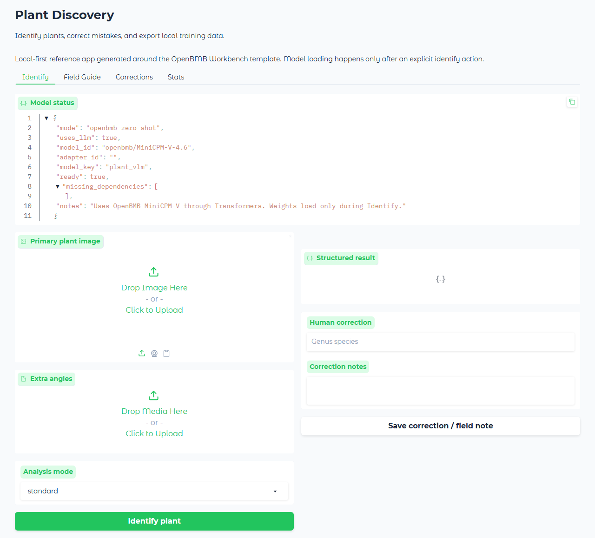
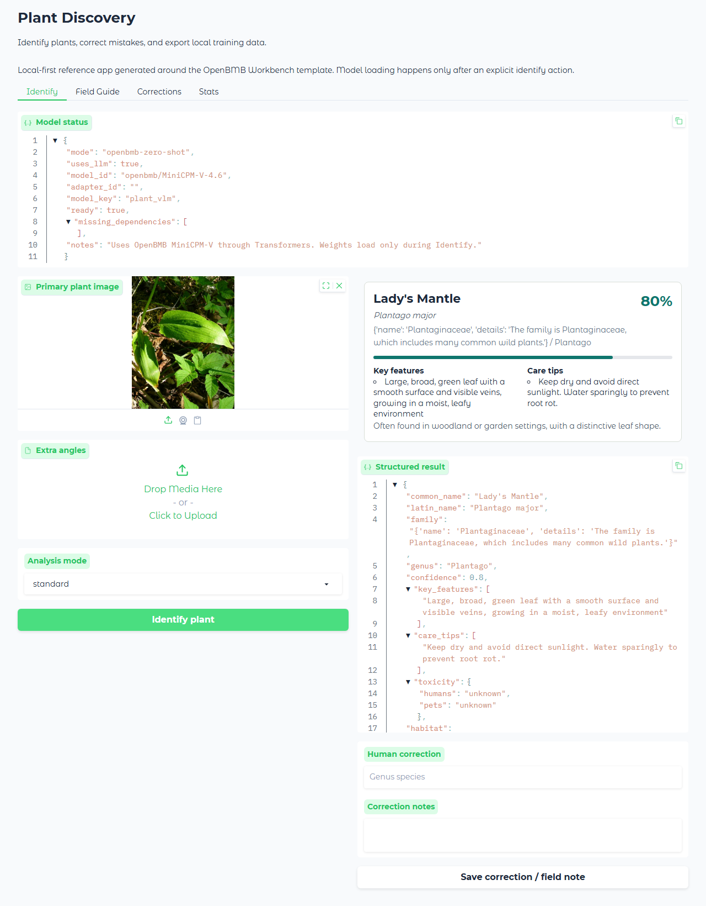
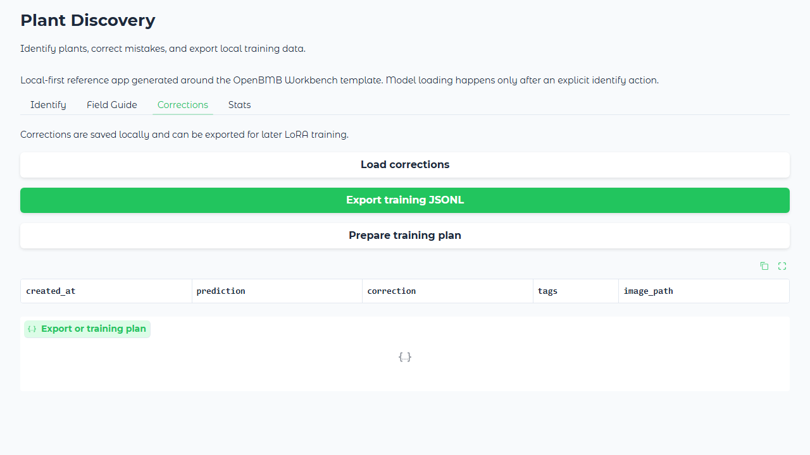
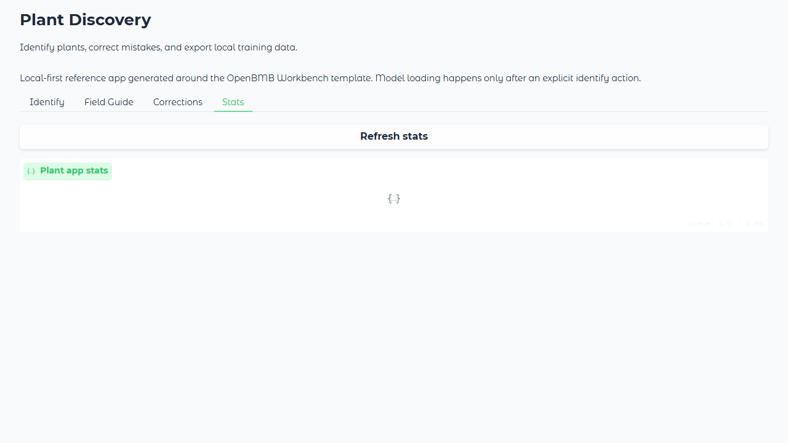

# Plant Identification Tool Screenshots

These screenshots use the OpenBMB-mode Plant Space entrypoint. Real model inference is executed only when `RUN_REAL_MODEL_E2E=1` is set.

## 1. Plant Tool Home

The Plant Space opens in OpenBMB real-model mode.

## 2. Real Model Identify

A public-safe image is ready for MiniCPM-V identification.

## 3. Corrections Export

Corrections export remains available for real model outputs.

## 4. Plant Stats

The Plant app reports species and correction counts.

