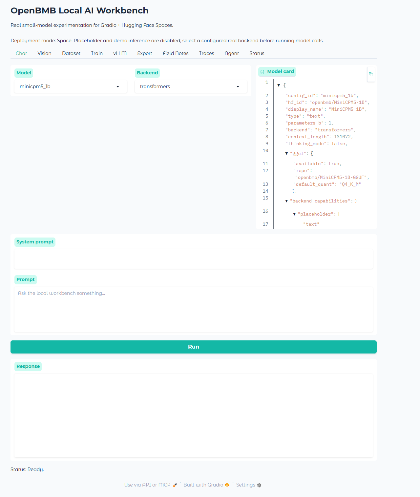
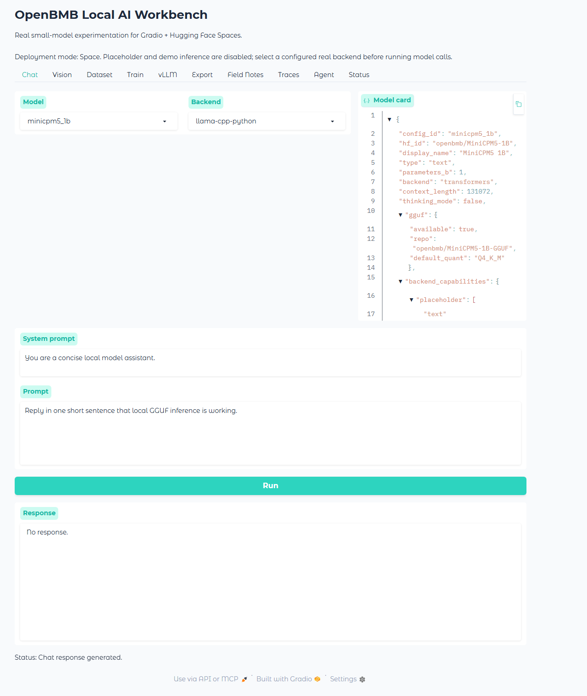
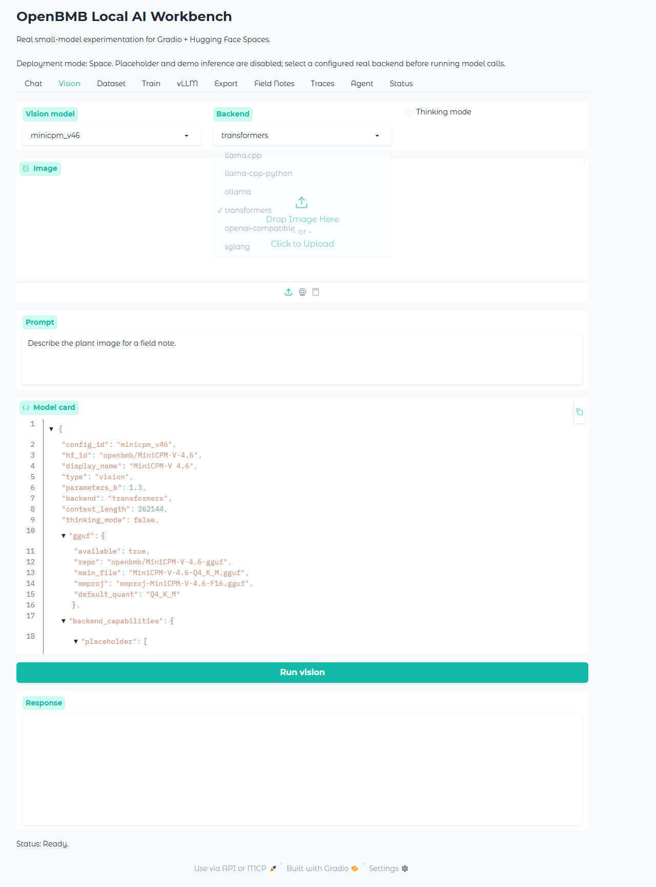
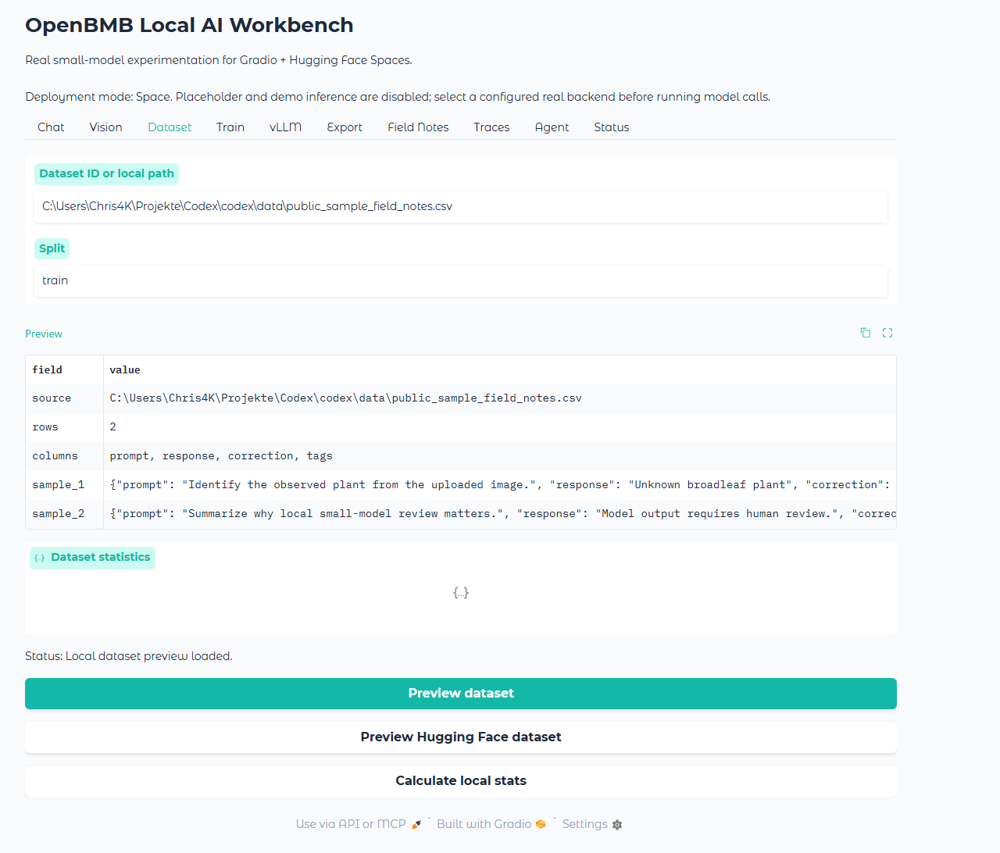
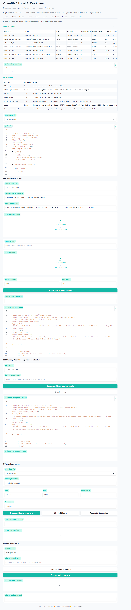

# Workbench Real-Backend Screenshots

These screenshots are generated without mock responses. The chat screenshot runs the local GGUF llama-cpp-python backend and captures the model response.

## 1. Workbench Home

The Workbench opens with real-backend setup visible.

## 2. Real Text Response

Chat generated a visible answer through the local GGUF llama-cpp-python backend.

## 3. Real Vision Backend

Vision is configured for a real MiniCPM-V Transformers backend.

## 4. Public Sample Data

The Workbench previews committed public-safe sample corrections.

## 5. Backend Status

Status lists OpenBMB models and real local backend readiness.

